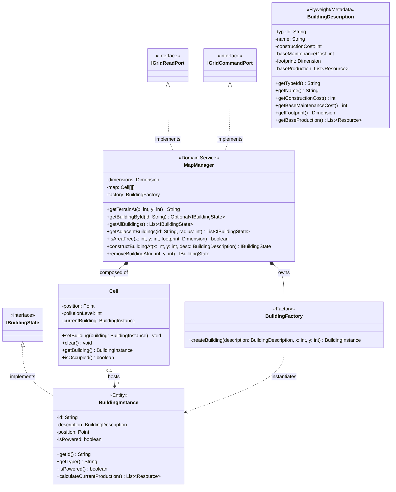

```mermaid
classDiagram
direction TB

    %% External Interfaces (Defined in SharedContracts)
    class IGridReadPort { <<interface>> }
    class IGridCommandPort { <<interface>> }
    class IBuildingState { <<interface>> }

    %% ==========================================
    %% MAP DOMAIN CORE
    %% ==========================================
    class MapManager {
        <<Domain Service>>
        -dimensions: Dimension
        -map: Cell[][]
        -factory: BuildingFactory
        +getTerrainAt(x: int, y: int) String
        +getBuildingById(id: String) Optional~IBuildingState~
        +getAllBuildings() List~IBuildingState~
        +getAdjacentBuildings(id: String, radius: int) List~IBuildingState~
        +isAreaFree(x: int, y: int, footprint: Dimension) boolean
        +constructBuildingAt(x: int, y: int, desc: BuildingDescription) IBuildingState
        +removeBuildingAt(x: int, y: int) IBuildingState
    }

    class BuildingInstance {
        <<Entity>>
        -id: String
        -description: BuildingDescription
        -position: Point
        -isPowered: boolean
        +getId() String
        +getType() String
        +isPowered() boolean
        +calculateCurrentProduction() List~Resource~
    }

    class Cell {
        -position: Point
        -pollutionLevel: int
        -currentBuilding: BuildingInstance
        +setBuilding(building: BuildingInstance) void
        +clear() void
        +getBuilding() BuildingInstance
        +isOccupied() boolean
    }

    class BuildingDescription {
        <<Flyweight/Metadata>>
        -typeId: String
        -name: String
        -constructionCost: int
        -baseMaintenanceCost: int
        -footprint: Dimension
        -baseProduction: List~Resource~
        +getTypeId() String
        +getName() String
        +getConstructionCost() int
        +getBaseMaintenanceCost() int
        +getFootprint() Dimension
        +getBaseProduction() List~Resource~
    }

    class BuildingFactory {
        <<Factory>>
        +createBuilding(description: BuildingDescription, x: int, y: int) BuildingInstance
    }

    %% Relations
    IGridReadPort <|.. MapManager : implements
    IGridCommandPort <|.. MapManager : implements
    IBuildingState <|.. BuildingInstance : implements

    MapManager *-- Cell : composed of
    MapManager *-- BuildingFactory : owns
    Cell "0..1" --> "1" BuildingInstance : hosts
    BuildingFactory ..> BuildingInstance : instantiates
```
