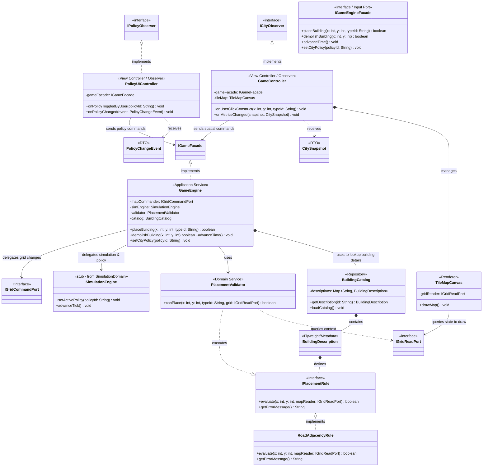

```mermaid
classDiagram
    direction TB

    %% ==========================================
    %% EXTERNAL BOUNDARIES (Defined in SharedContracts)
    %% ==========================================
    class BuildingDescription { <<Flyweight/Metadata>> }
    class IGridCommandPort { <<interface>> }
    class IGridReadPort { <<interface>> }
    class ICityObserver { <<interface>> }
    class IPolicyObserver { <<interface>> }
    class PolicyChangeEvent { <<DTO>> }
    class CitySnapshot { <<DTO>> }

    %% ==========================================
    %% APPLICATION LAYER (The Orchestrator / Facade)
    %% ==========================================
    class IGameEngineFacade {
        <<interface / Input Port>>
        +placeBuilding(x: int, y: int, typeId: String) boolean
        +demolishBuilding(x: int, y: int) boolean
        +advanceTime() void
        +setCityPolicy(policyId: String) void
    }

    class GameEngine {
        <<Application Service>>
        -mapCommander: IGridCommandPort
        -simEngine: SimulationEngine
        -validator: PlacementValidator
        -catalog: BuildingCatalog
        +placeBuilding(x: int, y: int, typeId: String) boolean
        +demolishBuilding(x: int, y: int) boolean        +advanceTime() void
        +setCityPolicy(policyId: String) void
    }

    class BuildingCatalog {
        <<Repository>>
        -descriptions: Map~String, BuildingDescription~
        +getDescription(id: String) BuildingDescription
        +loadCatalog() void
    }

    class PlacementValidator {
        <<Domain Service>>
        +canPlace(x: int, y: int, typeId: String, grid: IGridReadPort) boolean
    }

    class IPlacementRule {
        <<Interface>>
        +evaluate(x: int, y: int, mapReader: IGridReadPort) boolean
        +getErrorMessage() String
    }

    class RoadAdjacencyRule {
        +evaluate(x: int, y: int, mapReader: IGridReadPort) boolean
        +getErrorMessage() String
    }

    class SimulationEngine {
        <<stub - from SimulationDomain>>
        +setActivePolicy(policyId: String) void
        +advanceTick() void
    }

    %% ==========================================
    %% PRESENTATION LAYER (The View & Controllers)
    %% ==========================================
    class GameController {
        <<View Controller / Observer>>
        -gameFacade: IGameFacade
        -tileMap: TileMapCanvas
        +onUserClickConstruct(x: int, y: int, typeId: String) void
        +onMetricsChanged(snapshot: CitySnapshot) void
    }

    class PolicyUIController {
        <<View Controller / Observer>>
        -gameFacade: IGameFacade
        +onPolicyToggledByUser(policyId: String) void
        +onPolicyChanged(event: PolicyChangeEvent) void
    }

    class TileMapCanvas {
        <<Renderer>>
        -gridReader: IGridReadPort
        +drawMap() void
    }

    %% ==========================================
    %% RELATIONS
    %% ==========================================

    %% Implementation and External Ports
    IGameFacade <|.. GameEngine : implements
    ICityObserver <|.. GameController : implements
    IPolicyObserver <|.. PolicyUIController : implements
    IPlacementRule <|.. RoadAdjacencyRule : implements

    %% UI to Facade flow (Commands)
    GameController --> IGameFacade : sends spatial commands
    PolicyUIController --> IGameFacade : sends policy commands

    %% Observer flow (Events)
    PolicyUIController ..> PolicyChangeEvent : receives
    GameController ..> CitySnapshot : receives

    %% Facade to Domain flow (Internal Orchestration)
    GameEngine --> IGridCommandPort : delegates grid changes
    GameEngine --> SimulationEngine : delegates simulation & policy
    GameEngine --> PlacementValidator : uses
    GameEngine *-- BuildingCatalog: uses to lookup building details
    BuildingCatalog *-- BuildingDescription: contains
    BuildingDescription *-- IPlacementRule : defines
    PlacementValidator ..|> IPlacementRule : executes
    PlacementValidator ..> IGridReadPort : queries context

    %% Canvas rendering
    TileMapCanvas --> IGridReadPort : queries state to draw
    GameController *-- TileMapCanvas : manages
```
