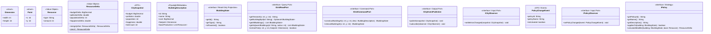

```mermaid
classDiagram
direction TB

    %% ==========================================
    %% VALUE OBJECTS & DTOs (Immutable Data)
    %% ==========================================
    class Dimension {
        <<struct>>
        +width: int
        +height: int
    }

    class Point {
        <<struct>>
        +x: int
        +y: int
    }

    class Resource {
        <<Value Object>>
        +type: String
        +amount: int
    }

    class ResourceDelta {
        <<Value Object>>
        +budgetDelta: BigDecimal
        +pollutionDelta: double
        +populationDelta: int
        +happinessDelta: double
        +merge(other: ResourceDelta) ResourceDelta
        +zero() ResourceDelta$
    }

    class CitySnapshot {
        <<DTO>>
        +budget: BigDecimal
        +pollution: double
        +population: int
        +happiness: double
        +tickCount: int
    }

    class BuildingDescription {
        <<Flyweight/Metadata>>
        +id: String
        +name: String
        +cost: BigDecimal
        +footprint: Dimension
        +baseProduction: List~Resource~
    }

    %% ==========================================
    %% DOMAIN PORTS (The Drawbridges)
    %% ==========================================
    class IBuildingState {
        <<interface / Read-Only Projection>>
        +getId() String
        +getType() String
        +isPowered() boolean
    }

    class IGridReadPort {
        <<interface / Query Port>>
        +getTerrainAt(x: int, y: int) String
        +getBuildingById(id: String) Optional~IBuildingState~
        +getAllBuildings() List~IBuildingState~
        +getAdjacentBuildings(id: String, radius: int) List~IBuildingState~
        +isAreaFree(x: int, y: int, footprint: Dimension) boolean
    }

    class IGridCommandPort {
        <<interface / Command Port>>
        +constructBuildingAt(x: int, y: int, desc: BuildingDescription) IBuildingState
        +removeBuildingAt(x: int, y: int) IBuildingState
    }

    class ICityEventPublisher {
        <<interface / Output Port>>
        +publish(snapshot: CitySnapshot) void
        +subscribe(observer: ICityObserver) void
    }

    class ICityObserver {
        <<interface / Input Port>>
        +onMetricsChanged(snapshot: CitySnapshot) void
    }

    class PolicyChangeEvent {
        <<DTO / Event>>
        +policyId: String
        +policyName: String
        +isActivated: boolean
    }

    class IPolicyObserver {
        <<interface / Input Port>>
        +onPolicyChanged(event: PolicyChangeEvent) void
    }

    class IPolicy {
        <<interface / Strategy>>
        +getPolicyId() String
        +getName() String
        +getDescription() String
        +appliesTo(building: IBuildingState) boolean
        +calculateModifier(building: IBuildingState, base: Resource) ResourceDelta
    }
```
