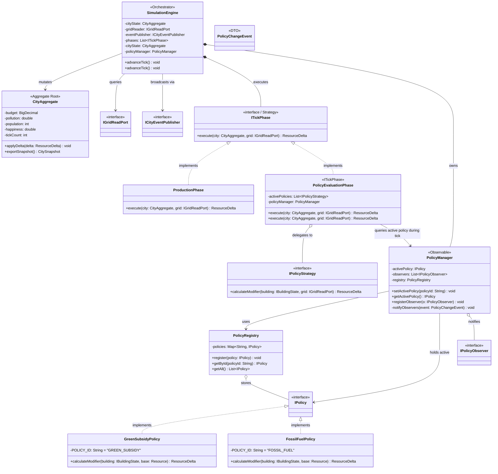

```mermaid
classDiagram
    direction TB

    %% External Interfaces (Defined in SharedContracts)
    class IGridReadPort { <<interface>> }
    class ICityEventPublisher { <<interface>> }

    %% ==========================================
    %% SIMULATION CORE
    %% ==========================================
    class CityAggregate {
        <<Aggregate Root>>
        -budget: BigDecimal
        -pollution: double
        -population: int
        -happiness: double
        -tickCount: int
        +applyDelta(delta: ResourceDelta) void
        +exportSnapshot() CitySnapshot
    }

    class SimulationEngine {
        <<Orchestrator>>
        -cityState: CityAggregate
        -gridReader: IGridReadPort
        -eventPublisher: ICityEventPublisher
        -phases: List~ITickPhase~
        +advanceTick() void
    }

    class ITickPhase {
        <<interface / Strategy>>
        +execute(city: CityAggregate, grid: IGridReadPort) ResourceDelta
    }

    class ProductionPhase {
        +execute(city: CityAggregate, grid: IGridReadPort) ResourceDelta
    }

    class PolicyEvaluationPhase {
        -activePolicies: List~IPolicyStrategy~
        +execute(city: CityAggregate, grid: IGridReadPort) ResourceDelta
    }

    class IPolicyStrategy {
        <<interface>>
        +calculateModifier(building: IBuildingState, grid: IGridReadPort) ResourceDelta
    }

    %% External Interfaces
    class IPolicy { <<interface>> }
    class IPolicyObserver { <<interface>> }
    class PolicyChangeEvent { <<DTO>> }

    %% ==========================================
    %% NEW POLICY SUBDOMAIN
    %% ==========================================
    class PolicyRegistry {
        -policies: Map~String, IPolicy~
        +register(policy: IPolicy) void
        +getById(policyId: String) IPolicy
        +getAll() List~IPolicy~
    }

    class PolicyManager {
        <<Observable>>
        -activePolicy: IPolicy
        -observers: List~IPolicyObserver~
        -registry: PolicyRegistry
        +setActivePolicy(policyId: String) void
        +getActivePolicy() IPolicy
        +registerObserver(o: IPolicyObserver) void
        -notifyObservers(event: PolicyChangeEvent) void
    }

    class GreenSubsidyPolicy {
        -POLICY_ID: String = "GREEN_SUBSIDY"
        +calculateModifier(building: IBuildingState, base: Resource) ResourceDelta
    }

    class FossilFuelPolicy {
        -POLICY_ID: String = "FOSSIL_FUEL"
        +calculateModifier(building: IBuildingState, base: Resource) ResourceDelta
    }

    %% ==========================================
    %% SIMULATION ENGINE INTEGRATION
    %% ==========================================
    class SimulationEngine {
        -cityState: CityAggregate
        -policyManager: PolicyManager
        +advanceTick() void
    }

    class PolicyEvaluationPhase {
        <<ITickPhase>>
        -policyManager: PolicyManager
        +execute(city: CityAggregate, grid: IGridReadPort) ResourceDelta
    }

    %% Relations
    SimulationEngine --> CityAggregate : mutates
    SimulationEngine --> IGridReadPort : queries
    SimulationEngine --> ICityEventPublisher : broadcasts via
    SimulationEngine *-- ITickPhase : executes

    ITickPhase <|.. ProductionPhase : implements
    ITickPhase <|.. PolicyEvaluationPhase : implements
    PolicyEvaluationPhase o-- IPolicyStrategy : delegates to
    IPolicy <|.. GreenSubsidyPolicy : implements
    IPolicy <|.. FossilFuelPolicy : implements

    PolicyRegistry o-- IPolicy : stores
    PolicyManager --> PolicyRegistry : uses
    PolicyManager --> IPolicy : holds active
    PolicyManager o-- IPolicyObserver : notifies

    SimulationEngine *-- PolicyManager : owns
    PolicyEvaluationPhase --> PolicyManager : queries active policy during tick
```
