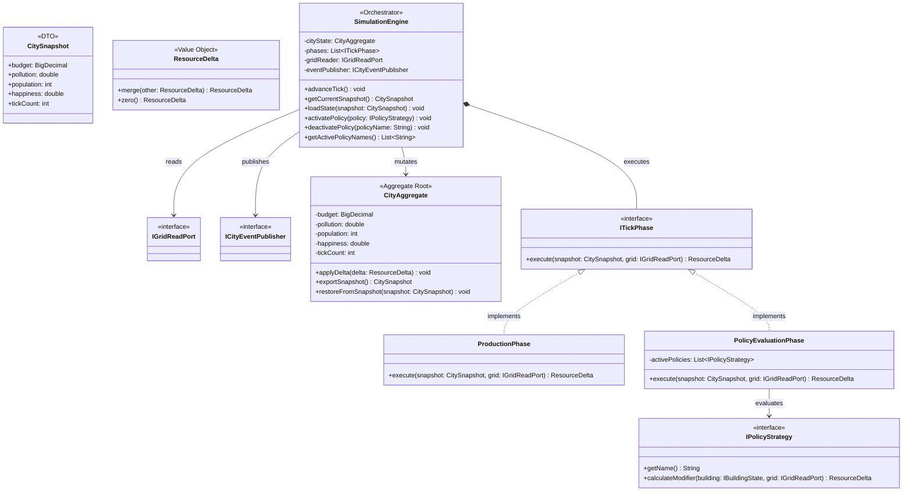

<!-- Status: current implementation reference. Keep aligned with src/main/java. -->

```mermaid
classDiagram
    direction TB

    %% External interfaces used by the current implementation
    class IGridReadPort { <<interface>> }
    class ICityEventPublisher { <<interface>> }

    class CityAggregate {
        <<Aggregate Root>>
        -budget: BigDecimal
        -pollution: double
        -population: int
        -happiness: double
        -tickCount: int
        +applyDelta(delta: ResourceDelta) void
        +exportSnapshot() CitySnapshot
        +restoreFromSnapshot(snapshot: CitySnapshot) void
    }

    class CitySnapshot {
        <<DTO>>
        +budget: BigDecimal
        +pollution: double
        +population: int
        +happiness: double
        +tickCount: int
    }

    class ResourceDelta {
        <<Value Object>>
        +merge(other: ResourceDelta) ResourceDelta
        +zero() ResourceDelta
    }

    class SimulationEngine {
        <<Orchestrator>>
        -cityState: CityAggregate
        -phases: List~ITickPhase~
        -gridReader: IGridReadPort
        -eventPublisher: ICityEventPublisher
        +advanceTick() void
        +getCurrentSnapshot() CitySnapshot
        +loadState(snapshot: CitySnapshot) void
        +activatePolicy(policy: IPolicyStrategy) void
        +deactivatePolicy(policyName: String) void
        +getActivePolicyNames() List~String~
    }

    class ITickPhase {
        <<interface>>
        +execute(snapshot: CitySnapshot, grid: IGridReadPort) ResourceDelta
    }

    class ProductionPhase {
        +execute(snapshot: CitySnapshot, grid: IGridReadPort) ResourceDelta
    }

    class PolicyEvaluationPhase {
        -activePolicies: List~IPolicyStrategy~
        +execute(snapshot: CitySnapshot, grid: IGridReadPort) ResourceDelta
    }

    class IPolicyStrategy {
        <<interface>>
        +getName() String
        +calculateModifier(building: IBuildingState, grid: IGridReadPort) ResourceDelta
    }

    SimulationEngine --> CityAggregate : mutates
    SimulationEngine --> IGridReadPort : reads
    SimulationEngine --> ICityEventPublisher : publishes
    SimulationEngine *-- ITickPhase : executes

    ITickPhase <|.. ProductionPhase : implements
    ITickPhase <|.. PolicyEvaluationPhase : implements
    PolicyEvaluationPhase --> IPolicyStrategy : evaluates
```
