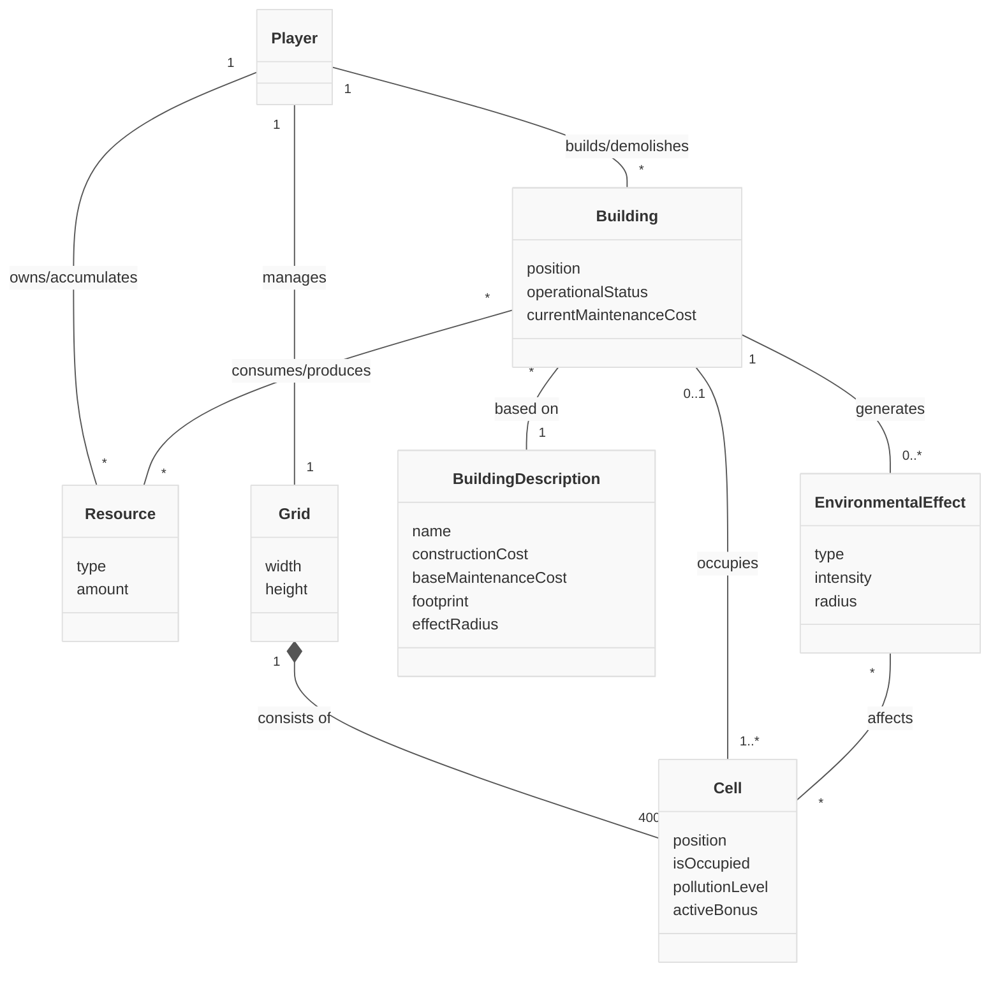
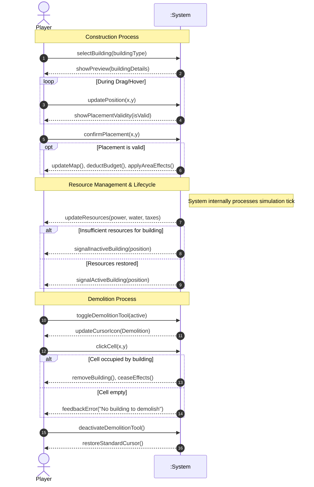
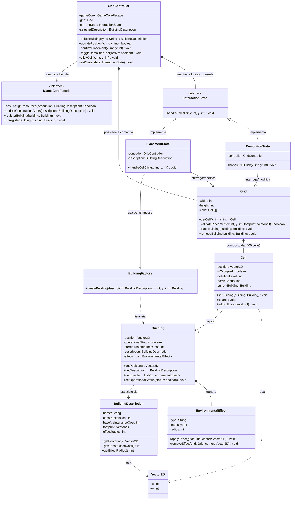

## Domain model

```mermaid
%%{init: {
  'theme': 'base',
  'themeVariables': {
    'primaryColor': '#f9f9f9',
    'strokeColor': '#333333',
    'lineColor': '#555555',
    'fontSize': '13px',
    'rx': 0, 'ry': 0
  },
  'config': { 'layout': 'orthogonal' }
}}%%
classDiagram
    direction TB

    class Player

    class Resource {
        type
        amount
    }

    %% Map
    class Cell {
        position
        isOccupied
        pollutionLevel
        activeBonus
    }

    class Grid {
        width
        height
    }

    %% Buildings
    class Building {
        position
        operationalStatus
        currentMaintenanceCost
    }

    class BuildingDescription {
        name
        constructionCost
        baseMaintenanceCost
        footprint
        effectRadius
    }

    class EnvironmentalEffect {
        type
        intensity
        radius
    }


    %% %%
    Player "1" -- "1" Grid : manages
    Player "1" -- "*" Resource : owns/accumulates
    Player "1" -- "*" Building : builds/demolishes
    Grid "1" *-- "400" Cell : consists of

    Building "0..1" -- "1..*" Cell : occupies
    Building "*" -- "1" BuildingDescription : based on
    Building "*" -- "*" Resource : consumes/produces
    Building "1" -- "0..*" EnvironmentalEffect : generates
    EnvironmentalEffect "*" -- "*" Cell : affects
```

## System Sequence Diagram

```mermaid
sequenceDiagram
    autonumber
    actor Player
    participant System as :System

    Note over Player, System: Construction Process
    Player->>System: selectBuilding(buildingType)
    System-->>Player: showPreview(buildingDetails)

    loop During Drag/Hover
        Player->>System: updatePosition(x,y)
        System-->>Player: showPlacementValidity(isValid)
    end

    Player->>System: confirmPlacement(x,y)
    opt Placement is valid
        System-->>Player: updateMap(), deductBudget(), applyAreaEffects()
    end

    Note over Player, System: Resource Management & Lifecycle
    Note right of System: System internally processes simulation tick

    System-->>Player: updateResources(power, water, taxes)

    alt Insufficient resources for building
        System-->>Player: signalInactiveBuilding(position)
    else Resources restored
        System-->>Player: signalActiveBuilding(position)
    end

    Note over Player, System: Demolition Process
    Player->>System: toggleDemolitionTool(active)
    System-->>Player: updateCursorIcon(Demolition)

    Player->>System: clickCell(x,y)
    alt Cell occupied by building
        System-->>Player: removeBuilding(), ceaseEffects()
    else Cell empty
        System-->>Player: feedbackError("No building to demolish")
    end

    Player->>System: deactivateDemolitionTool()
    System-->>Player: restoreStandardCursor()
```

# Design class diagram

```mermaid
classDiagram
    direction TB

    %% INTERFACCE E CORE ESTERNO (DISACCOPPIAMENTO)
    class IGameCoreFacade {
        <<interface>>
        +hasEnoughResources(description: BuildingDescription) boolean
        +deductConstructionCosts(description: BuildingDescription) void
        +registerBuilding(building: Building) void
        +unregisterBuilding(building: Building) void
    }

    %% CONTROLLER & STATI (GRASP / GoF STATE)
    class GridController {
        -gameCore: IGameCoreFacade
        -grid: Grid
        -currentState: InteractionState
        -selectedDescription: BuildingDescription
        +selectBuilding(type: String) BuildingDescription
        +updatePosition(x: int, y: int) boolean
        +confirmPlacement(x: int, y: int) void
        +toggleDemolitionTool(active: boolean) void
        +clickCell(x: int, y: int) void
        +setState(state: InteractionState) void
    }

    class InteractionState {
        <<interface>>
        +handleCellClick(x: int, y: int) void
    }

    class PlacementState {
        -controller: GridController
        -description: BuildingDescription
        +handleCellClick(x: int, y: int) void
    }

    class DemolitionState {
        -controller: GridController
        +handleCellClick(x: int, y: int) void
    }

    %% GOF SIMPLE FACTORY
    class BuildingFactory {
        +createBuilding(description: BuildingDescription, x: int, y: int) Building
    }

    %% DOMINIO LOCALE (MAPPA ED EDIFICI)
    class Grid {
        -width: int
        -height: int
        -cells: Cell[][]
        +getCell(x: int, y: int) Cell
        +validatePlacement(x: int, y: int, footprint: Vector2D) boolean
        +placeBuilding(building: Building) void
        +removeBuilding(building: Building) void
    }

    class Cell {
        -position: Vector2D
        -isOccupied: boolean
        -pollutionLevel: int
        -activeBonus: int
        -currentBuilding: Building
        +setBuilding(building: Building) void
        +clear() void
        +addPollution(level: int) void
    }

    class Building {
        -position: Vector2D
        -operationalStatus: boolean
        -currentMaintenanceCost: int
        -description: BuildingDescription
        -effects: List~EnvironmentalEffect~
        +getPosition() Vector2D
        +getDescription() BuildingDescription
        +getEffects() List~EnvironmentalEffect~
        +setOperationalStatus(status: boolean) void
    }

    class BuildingDescription {
        -name: String
        -constructionCost: int
        -baseMaintenanceCost: int
        -footprint: Vector2D
        -effectRadius: int
        +getFootprint() Vector2D
        +getConstructionCost() int
        +getEffectRadius() int
    }

    class EnvironmentalEffect {
        -type: String
        -intensity: int
        -radius: int
        +applyEffect(grid: Grid, center: Vector2D) void
        +removeEffect(grid: Grid, center: Vector2D) void
    }

    class Vector2D {
        +x: int
        +y: int
    }

    %% RELAZIONI E NAVIGABILITÀ
    GridController --> IGameCoreFacade : comunica tramite
    GridController *-- Grid : possiede e comanda
    GridController *-- InteractionState : mantiene lo stato corrente

    InteractionState <|.. PlacementState : implementa
    InteractionState <|.. DemolitionState : implementa

    PlacementState --> BuildingFactory : usa per istanziare
    PlacementState --> Grid : interroga/modifica
    DemolitionState --> Grid : interroga/modifica

    BuildingFactory ..> Building : istanzia

    Grid *-- Cell : composto da (400 celle)
    Cell "0..1" --> "0..1" Building : ospita

    Building "*" --> "1" BuildingDescription : istanziato da
    Building *-- EnvironmentalEffect : genera

    Cell ..> Vector2D : usa
    BuildingDescription ..> Vector2D : usa
```
