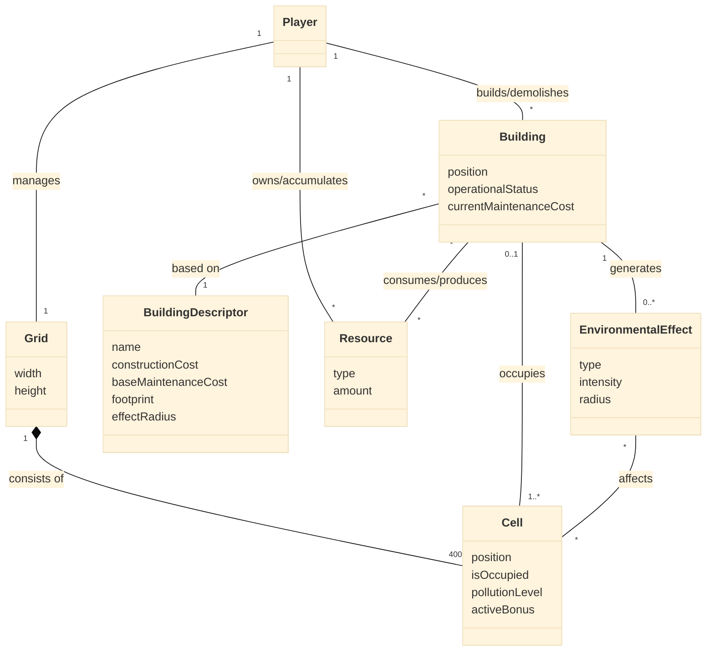

## Domain model

```mermaid
%%{init: {'theme': 'base', 'config': {'layout': 'orthogonal'}}}%%
classDiagram
    direction TB

    class Player

    class Cell {
        position
        isOccupied
        pollutionLevel
        activeBonus
    }

    class Grid {
        width
        height
    }

    class Building {
        position
        operationalStatus
        currentMaintenanceCost
    }

    class BuildingDescriptor {
        name
        constructionCost
        baseMaintenanceCost
        footprint
        effectRadius
    }

    class Resource {
        type
        amount
    }

    class EnvironmentalEffect {
        type
        intensity
        radius
    }

    %% Relazioni e Molteplicità
    Player "1" -- "1" Grid : manages
    Player "1" -- "*" Resource : owns/accumulates
    Player "1" -- "*" Building : builds/demolishes

    %% Composizione forte (il rombo è su Grid)
    Grid "1" *-- "400" Cell : consists of

    Building "0..1" -- "1..*" Cell : occupies
    Building "*" -- "1" BuildingDescriptor : based on
    Building "*" -- "*" Resource : consumes/produces
    Building "1" -- "0..*" EnvironmentalEffect : generates
    EnvironmentalEffect "*" -- "*" Cell : affects
```
