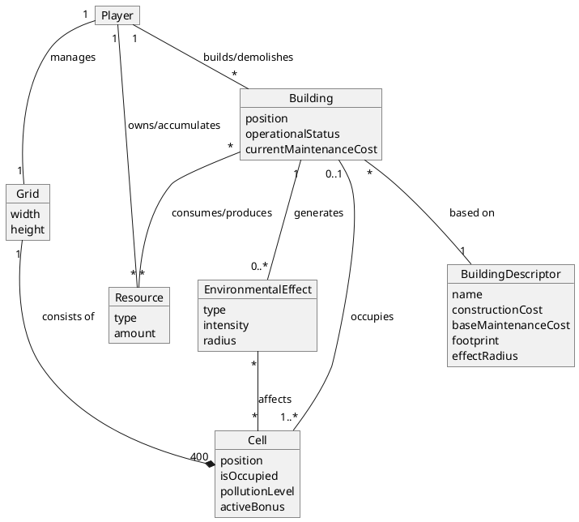

## Domain model

```plantuml
@startuml
' Impedisce la visualizzazione del box dei metodi se vuoto
hide empty attributes
hide empty members
object Player

object Cell {
    position
    isOccupied
    pollutionLevel
    activeBonus
}
object Grid {
    width
    height
}
object Building {
    position
    operationalStatus
    currentMaintenanceCost
}

object BuildingDescriptor {
    name
    constructionCost
    baseMaintenanceCost
    footprint
    effectRadius
}
object Resource {
    type
    amount
}
object EnvironmentalEffect {
    type
    intensity
    radius
}

' Relazioni e Molteplicità
Player "1" -- "1" Grid : manages
Player "1" -- "*" Resource : owns/accumulates
Player "1" -- "*" Building : builds/demolishes
Grid "1" --* "400" Cell : consists of
Building "0..1" -- "1..*" Cell : occupies
Building "*" -- "1" BuildingDescriptor : based on
Building "*" -- "*" Resource : consumes/produces
Building "1" -- "0..*" EnvironmentalEffect : generates
EnvironmentalEffect "*" -- "*" Cell : affects
@enduml
```
