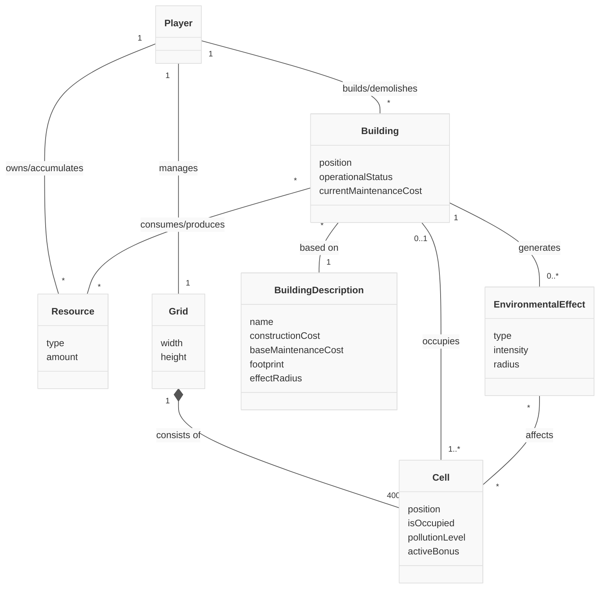
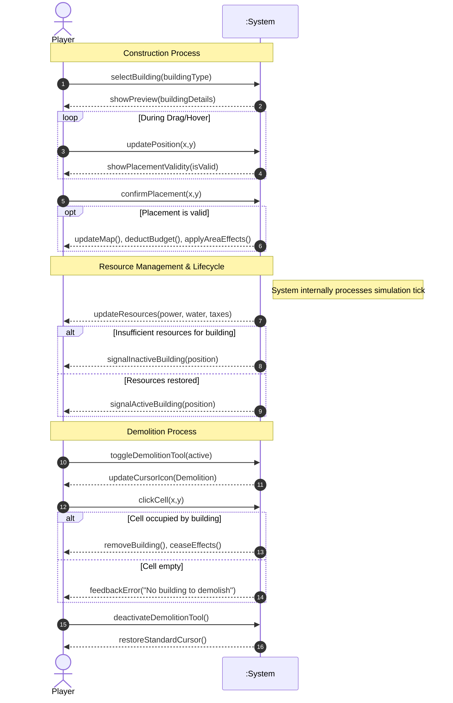

## Domain model

```mermaid
%%{init: {
  'theme': 'base',
  'themeVariables': {
    'primaryColor': '#f9f9f9',
    'strokeColor': '#333333',
    'lineColor': '#555555',
    'fontSize': '13px',
    'rx': 0, 'ry': 0
  },
  'config': { 'layout': 'orthogonal' }
}}%%
classDiagram
    direction TB

    class Player

    class Resource {
        type
        amount
    }

    %% Map
    class Cell {
        position
        isOccupied
        pollutionLevel
        activeBonus
    }

    class Grid {
        width
        height
    }

    %% Buildings
    class Building {
        position
        operationalStatus
        currentMaintenanceCost
    }

    class BuildingDescription {
        name
        constructionCost
        baseMaintenanceCost
        footprint
        effectRadius
    }

    class EnvironmentalEffect {
        type
        intensity
        radius
    }


    %% %%
    Player "1" -- "1" Grid : manages
    Player "1" -- "*" Resource : owns/accumulates
    Player "1" -- "*" Building : builds/demolishes
    Grid "1" *-- "400" Cell : consists of

    Building "0..1" -- "1..*" Cell : occupies
    Building "*" -- "1" BuildingDescription : based on
    Building "*" -- "*" Resource : consumes/produces
    Building "1" -- "0..*" EnvironmentalEffect : generates
    EnvironmentalEffect "*" -- "*" Cell : affects
```

## System Sequence Diagram

```mermaid
sequenceDiagram
    autonumber
    actor Player
    participant System as :System

    Note over Player, System: Construction Process
    Player->>System: selectBuilding(buildingType)
    System-->>Player: showPreview(buildingDetails)

    loop During Drag/Hover
        Player->>System: updatePosition(x,y)
        System-->>Player: showPlacementValidity(isValid)
    end

    Player->>System: confirmPlacement(x,y)
    opt Placement is valid
        System-->>Player: updateMap(), deductBudget(), applyAreaEffects()
    end

    Note over Player, System: Resource Management & Lifecycle
    Note right of System: System internally processes simulation tick

    System-->>Player: updateResources(power, water, taxes)

    alt Insufficient resources for building
        System-->>Player: signalInactiveBuilding(position)
    else Resources restored
        System-->>Player: signalActiveBuilding(position)
    end

    Note over Player, System: Demolition Process
    Player->>System: toggleDemolitionTool(active)
    System-->>Player: updateCursorIcon(Demolition)

    Player->>System: clickCell(x,y)
    alt Cell occupied by building
        System-->>Player: removeBuilding(), ceaseEffects()
    else Cell empty
        System-->>Player: feedbackError("No building to demolish")
    end

    Player->>System: deactivateDemolitionTool()
    System-->>Player: restoreStandardCursor()
```
