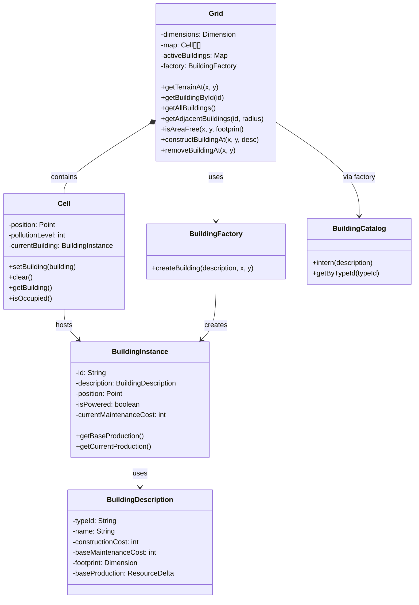
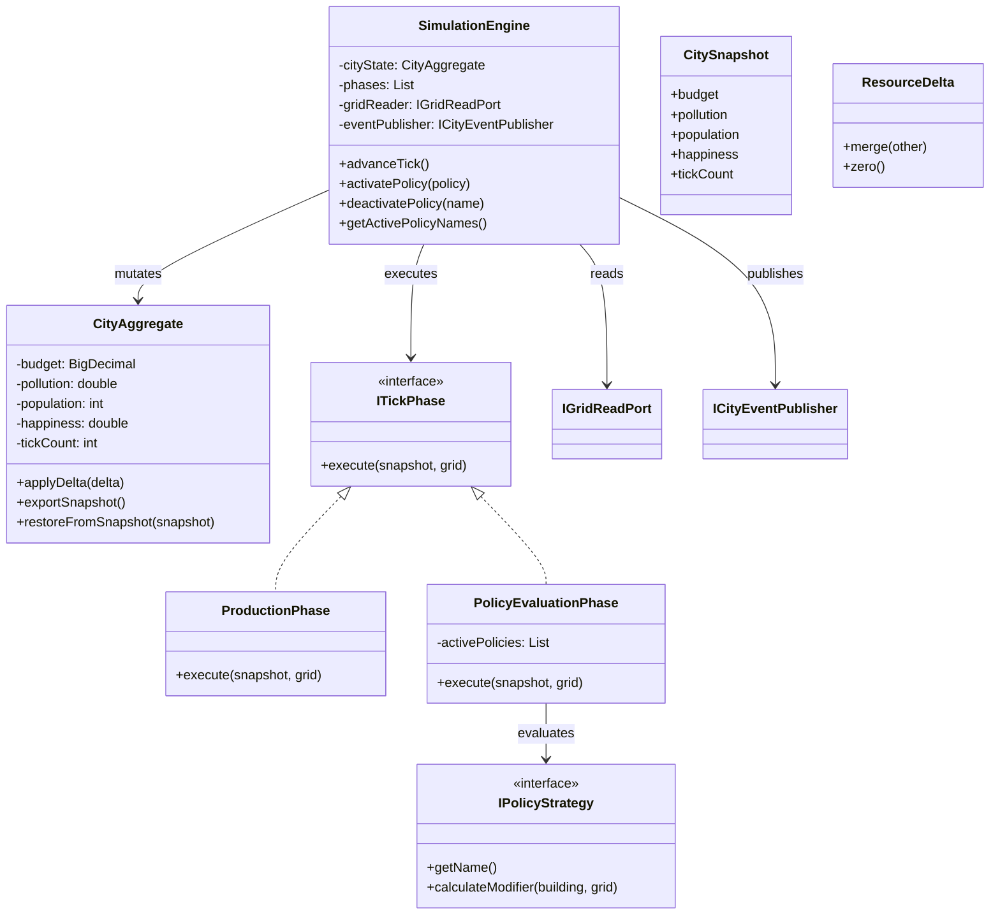

## Domain model

The current implementation is organized around a more concrete, domain-driven structure than the original abstract UML. The sections below reflect what is actually present in the codebase.

## Current architecture overview

- Map and buildings: Grid, Cell, BuildingDescription, BuildingInstance, BuildingFactory, BuildingCatalog
- Simulation: SimulationEngine, CityAggregate, CitySnapshot, ResourceDelta, ProductionPhase, PolicyEvaluationPhase
- Application facade: GameEngine
- Ports: IGridReadPort, IGridCommandPort, IBuildingState, ICityEventPublisher, IPolicyStrategy

## Map module: current implementation



### Where the implementation is better

- The implementation is stronger on actual gameplay rules: placement validation, cell occupation, demolition logic, and building footprint handling are all enforced in the grid layer.
- The use of BuildingCatalog as a flyweight registry makes building metadata sharing explicit and more robust than a purely conceptual diagram.

### Where the older diagram is better

- The original diagram is still clearer for high-level communication because it shows the intended conceptual roles of map manager and building metadata more simply.
- It is also better as a planning artifact for the group because it communicates responsibilities at a higher level.

## Simulation module: current implementation



### Where the implementation is better

- The implementation is stronger on runtime correctness: the tick is transactional, uses snapshots, and can roll back when invariants are violated.
- The phase-based pipeline is easier to test and evolve than a single monolithic simulation loop.
- ResourceDelta is a cleaner representation for aggregating economic and environmental changes than a more loosely typed diagram.

### Where the older diagram is better

- The older diagram is more expressive if the policy subsystem is later expanded into a richer manager/observer architecture.
- It is also better for conceptual discussions with non-developers because it highlights the intended policy flow at a higher level.

## Bottom line

For the current project state:

- The map and building implementation is more precise than the earlier diagram.
- The simulation implementation is more robust and testable than the earlier diagram.
- The older diagrams are still useful as design intent, but the code should be treated as the authoritative source for the current version of the project.

          +constructBuilding(x: int, y: int, selectedDesc: BuildingDescription) boolean
          +demolishBuilding(x: int, y: int) boolean
          +getBuildingDescriptionById(description_id: String) BuildingDescription
          +getBuildingPreviewDetails(x: int, y: int, desc: BuildingDescription) ProductionDisplayDetails

          %% Internal logic methods and external modules
          ~registerPolicyObserver(observer: IPolicyObserver) void
          ~unregisterPolicyObserver(observer: IPolicyObserver) void
          ~activatePolicy(policy: Policy) void
          -notifyPolicyObservers(event: PolicyChangeEvent) void
          -hasEnoughResources(desc: BuildingDescription) boolean
          -deductConstructionCosts(desc: BuildingDescription) void

    }

    %% ==========================================
    %% 5. USER INTERFACE (CONTROLLER)
    %% ==========================================
    class MapController {
    %% Middleman: converts UI input into GameCore calls
    -gameCore: IGameCoreFacade
    -currentTool: ToolType
    -selectedBuildingDesc: BuildingDescription
    +clickCell(x: int, y: int) void
    +hoverCell(x: int, y: int) void
    +selectBuildingForPlacement(description_id: String) void
    +toggleDemolitionTool(active: boolean) void
    }

    %% ==========================================
    %% 6. MAP MANAGEMENT (GEOMETRY AND CELLS)
    %% ==========================================
    class MapManager {
    %% Spatial Manager: Controls placement and coordinates, ignores economy
    -dimensions: Dimension
    -map: Cell[][]
    -factory: BuildingFactory
    +getCell(x: int, y: int) Cell
    +validateSpatialPlacement(x: int, y: int, footprint: Dimension) boolean
    +constructBuildingAt(x: int, y: int, desc: BuildingDescription) BuildingInstance
    +removeBuildingAt(x: int, y: int) BuildingInstance
    }

    class BuildingFactory {
    <<simple factory>>
    +createBuilding(description: BuildingDescription, x: int, y: int) BuildingInstance
    }

    class Cell {
    %% Base cell of the two-dimensional grid
    -position: Point
    -pollutionLevel: int
    -currentBuilding: BuildingInstance
    +setBuilding(building: BuildingInstance) void
    +clear() void
    +getBuilding() BuildingInstance
    +isOccupied() boolean
    }

    %% ==========================================
    %% 7. GAME ENTITIES (BUILDINGS)
    %% ==========================================
    class BuildingInstance {
    %% Physical Instance: Building placed on the map
    -position: Point
    -operationalStatus: boolean
    -description: BuildingDescription
    -activeAppliedPolicies: List~Policy~
    +onPolicyChanged(event: PolicyChangeEvent) void
    +calculateCurrentProduction() List~Resource~
    +getPosition() Point
    +getDescription() BuildingDescription
    }

    class BuildingDescription {
    <<flyweight / metadata>>
    %% Immutable Data: Costs, footprint and rules shared among similar instances
    -name: String
    -constructionCost: int
    -footprint: Dimension
    -baseProduction: List~Resource~
    -placementRules: List~IPlacementRule~
    +getFootprint() Dimension
    +getConstructionCost() int
    +getBaseProduction() List~Resource~
    +getPlacementRules() List~IPlacementRule~
    }

    %% ==========================================
    %% ARCHITECTURAL RELATIONS AND DEPENDENCIES
    %% ==========================================

    %% UI Input and DTO
    MapController --> ToolType : selects
    MapController --> IGameCoreFacade : sends commands to
    IGameCoreFacade <|.. GameCore : implements
    GameCore ..> ProductionDisplayDetails : generates
    MapController ..> ProductionDisplayDetails : reads

    %% Core, Catalog and Dimensions
    GameCore "1" o-- "_" BuildingDescription : contains catalog
    BuildingDescription _-- Dimension : uses for footprint
    MapManager \*-- Dimension : uses for map size

    %% Adjacency and Validation Rules
    BuildingDescription \*-- IPlacementRule : defines rules per type
    IPlacementRule <|.. RoadAdjacencyRule : implements
    IPlacementRule ..> MapManager : analyzes adjacencies on
    GameCore ..> IPlacementRule : executes validation

    %% Map Orchestration and Factory
    GameCore --> MapManager : orchestrates
    MapManager _-- BuildingFactory : owns
    MapManager _-- Cell : composed of
    BuildingFactory ..> BuildingInstance : instantiates
    Cell "0..1" --> "1" BuildingInstance : hosts

    %% Observer Pattern (Policy)
    IPolicyObserver <|.. BuildingInstance : implements
    GameCore "1" o-- "\*" IPolicyObserver : notifies changes
    BuildingInstance ..> PolicyChangeEvent : reacts to
    GameCore ..> PolicyChangeEvent : creates event

    %% Strategy Pattern and Building Meta-Data
    BuildingInstance "_" --> "1" BuildingDescription : reads base data from
    BuildingInstance "0.._" o-- "0..\*" Policy : actively applies
    Policy <|.. GreenSubsidyPolicy : implements
    BuildingInstance ..> Resource : generates
    Policy ..> Resource : modifies

```

```
