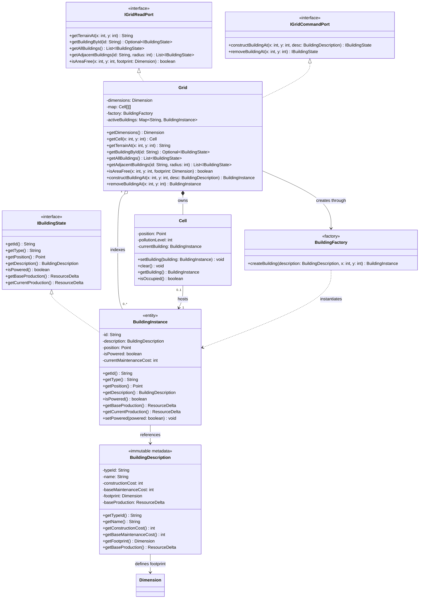
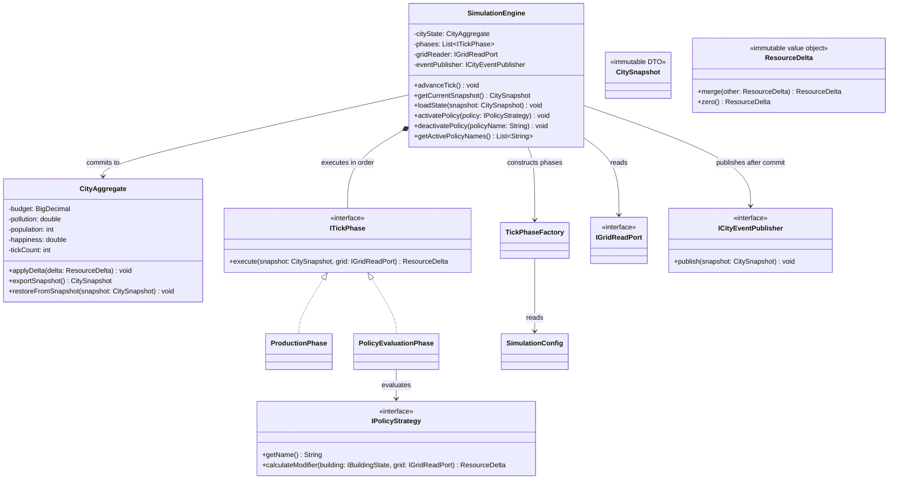
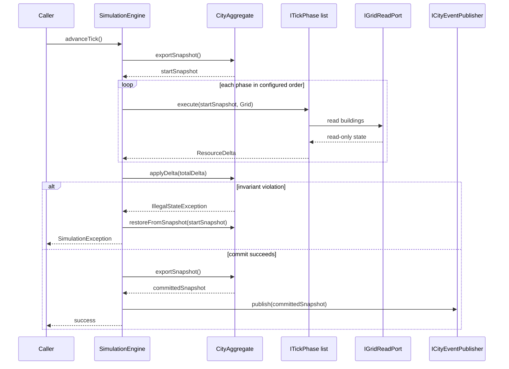

# CityLogic domain design

This document describes the implemented Building/map domain and simulation engine. The Java source and tests are authoritative when this document and an older diagram disagree.

## Scope and boundaries

| Area                      | Responsibility                                                                             | Main types                                                                   |
| ------------------------- | ------------------------------------------------------------------------------------------ | ---------------------------------------------------------------------------- |
| Building/map domain       | Store the grid, query spatial state, validate footprints, place and remove buildings       | `Grid`, `Cell`, `BuildingDescription`, `BuildingInstance`, `BuildingFactory` |
| Application orchestration | Resolve building types, validate commands, and delegate map/time operations                | `GameEngine`, `BuildingCatalog`, `PlacementValidator`                        |
| Simulation engine         | Execute phases, aggregate metric deltas, and commit or roll back city state                | `SimulationEngine`, `ITickPhase`, `CityAggregate`, `ResourceDelta`           |
| Policy                    | Provide strategies evaluated by a simulation phase; detailed policy rules are out of scope | `IPolicyStrategy`, `PolicyEvaluationPhase`                                   |
| UI/presentation           | Consume commands and published snapshots; out of scope here                                | Presentation module                                                          |

`Grid` implements both `IGridReadPort` and `IGridCommandPort`. The simulation engine receives only `IGridReadPort`, so phases cannot mutate the map. `GameEngine` is the application-facing facade used by the presentation layer.

## Building and map domain

### Map invariants and behavior

- A `Grid` requires a non-null `Dimension` and `BuildingFactory` and creates one cell for every in-bounds coordinate.
- `isAreaFree` rejects null, out-of-bounds, and occupied footprints.
- `constructBuildingAt` rejects invalid input, creates one instance at the origin, writes that instance into every cell in its footprint, and indexes it by ID.
- `removeBuildingAt` returns null for an invalid or empty coordinate. Otherwise it clears the complete footprint and removes the instance from the active index.
- `getAdjacentBuildings` uses Chebyshev distance, `max(abs(dx), abs(dy)) <= radius`, and excludes the queried instance.
- `BuildingDescription` is immutable metadata. `BuildingCatalog` is an application-level type lookup and is not a dependency of `Grid` or `BuildingFactory`.

## Simulation engine

### Tick transaction

Each phase receives the same start-of-tick snapshot and read-only grid port. A phase must not mutate the city or grid and must return a non-null `ResourceDelta`; the engine merges all deltas and applies the total once. A failed invariant restores the start snapshot and publishes no event. Public engine methods are synchronized for city-state access, while callers must coordinate concurrent mutations of the concrete grid.

`ProductionPhase` sums base production from powered buildings. `PolicyEvaluationPhase` evaluates active `IPolicyStrategy` instances; its detailed rules belong to the policy workstream and are intentionally not defined here.

## Related documents

- [Map and building class diagram](Design%20Class%20Diagrams/mapDomain.md)
- [Simulation engine class diagram](Design%20Class%20Diagrams/simulationDomain.md)
- [Shared contracts](Design%20Class%20Diagrams/sharedContracts.md)
- [Presentation and policy diagram](Design%20Class%20Diagrams/presentationDomain.md), maintained separately
- [`prompt-log/`](prompt-log/), historical design-generation notes
