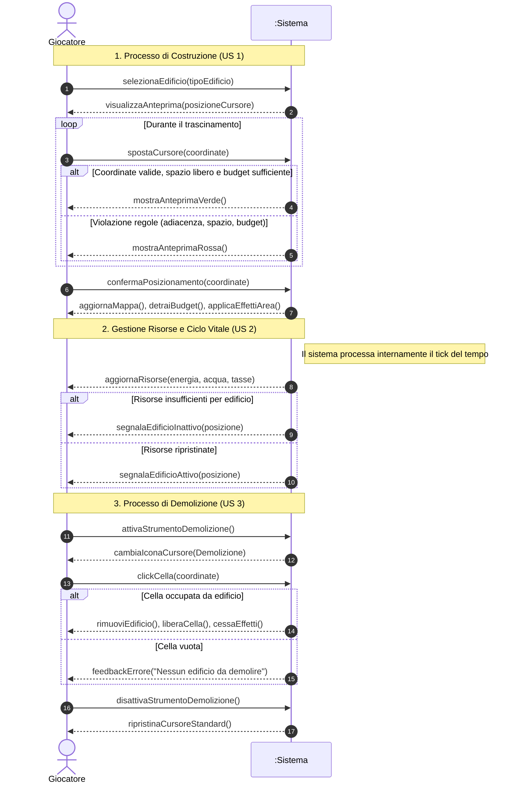

# 1

Agisci come un Software Architect. Sto lavorando a un progetto per un simulatore di città in cui l'utente deve costruire edifici all'interno di una mappa (griglia). Devo realizzare un system sequence diagram.
Tratta il sistema come una scatola nera, gli unici attori presenti devono essere il giocatore ed un singolo nodo chiamato :sistema, quindi non far vedere come il sistema elabora internamente la richiesta.

I messaggi dall'Attore al Sistema rappresentano "Eventi di Sistema".
I messaggi dal Sistema all'Attore rappresentano i dati di ritorno o feedback visivi.

Leggi le seguenti user stories con i relativi criteri di accettazione forniti di seguito ed individua i flussi principali generando un codice in mermaid.js:

1 - "Come giocatore, voglio che il sistema mi permetta di posizionare edifici sulla mappa a griglia affinché io possa definire la struttura della mia città.
Descrizione
Limiti della griglia: Il posizionamento degli edifici deve avvenire strettamente all’interno delle coordinate della griglia 20x20
Spazio libero: Il posizionamento deve avvenire su una casella in cui non sono presenti altri edifici.
Regole di adiacenza: Il posizionamento degli edifici deve avvenire INSERIRE REGOLE.
Costo di costruzione: Al momento della costruzione il costo dell’edificio deve essere sottratto dal budget del giocatore.
Feedback visivo: Durante il posizionamento, il sistema deve mostrare un’anteprima dell’edificio (verde valido, rosso non valido)."

2 - "Come giocatore, voglio che gli edifici consumino risorse e generino effetti (positivi o negativi) sull'area circostante, affinché la gestione della città richieda pianificazione e strategia.
Descrizione
Consumo e manutenzione: Gli edifici attivi devono consumare energia e acqua o sottrarre costi di mantenimento.
Produzione: Gli edifici specifici (es. residenziali, commerciali) devono generare periodicamente popolazione o tasse.
Effetti ad area: Gli edifici di servizio devono fornire bonus alle celle entro un determinato raggio.
Inquinamento: Gli edifici industriali devono generare inquinamento nelle caselle adiacenti.
Stato di inattività: Se un edificio non riceve le risorse necessarie deve smettere di funzionare e segnalare visivamente il problema."

3 - "Come giocatore, voglio poter demolire edifici presenti nella mappa affinché io possa liberare spazio e riorganizzare la struttura della mia città.
Descrizione
Selezione valida: Lo strumento di demolizione deve avere effetto solamente su celle attualmente occupate da un edificio.
Liberazione celle: Le celle occupate dall’edificio demolito devono immediatamente tornare disponibili per il posizionamento di altri edifici.
Rimozione effetti: La demolizione di un edificio deve annullare immediatamente gli effetti ed i consumi legati a quell’edificio.
Icona selezionabile: Presenza di un’icona che permette di attivare/disattivare lo strumento di demolizione"

Certamente. In qualità di Software Architect, ho analizzato le tue User Stories per mappare le interazioni chiave tra l'attore (**Giocatore**) e la "scatola nera" (**Sistema**).

Un **System Sequence Diagram (SSD)** si concentra sugli eventi di input che attraversano il confine del sistema. Di seguito trovi la modellazione dei tre flussi principali: costruzione, gestione/ciclo vitale e demolizione.

### Considerazioni Architetturali

- **Eventi di Sistema:** Ho utilizzato nomi di metodi chiari che rappresentano l'intenzione dell'utente (es. `selezionaStrumento`, `confermaPosizionamento`).
- **Feedback:** Il sistema risponde con dati visivi (anteprima, aggiornamento budget) o cambiamenti di stato (attivazione/disattivazione modalità).
- **Logica di Business:** Sebbene il sistema sia una scatola nera, i messaggi di ritorno riflettono l'esito delle validazioni (es. "Update preview (Valid/Invalid)").

---

### System Sequence Diagram (Mermaid.js)

---

### Analisi dei Flussi

- **Costruzione:** Il diagramma evidenzia il feedback continuo (loop di anteprima) necessario per soddisfare i criteri di accettazione visivi. La validazione delle regole di adiacenza e del budget avviene "dentro" il sistema, restituendo solo il colore del feedback.
- **Gestione:** Trattandosi di un simulatore, ho inserito la notifica asincrona (Tick) del sistema che aggiorna il giocatore sullo stato di operatività degli edifici e sulle risorse residue.
- **Demolizione:** È stato modellato come un cambio di stato dell'interfaccia (Attiva/Disattiva strumento) seguito dall'evento di interazione sulla griglia.

Hai già definito le **regole di adiacenza** specifiche (es. gli edifici devono essere vicini a una strada o non possono stare vicino alle industrie) o preferisci che integriamo una logica di validazione standard?
