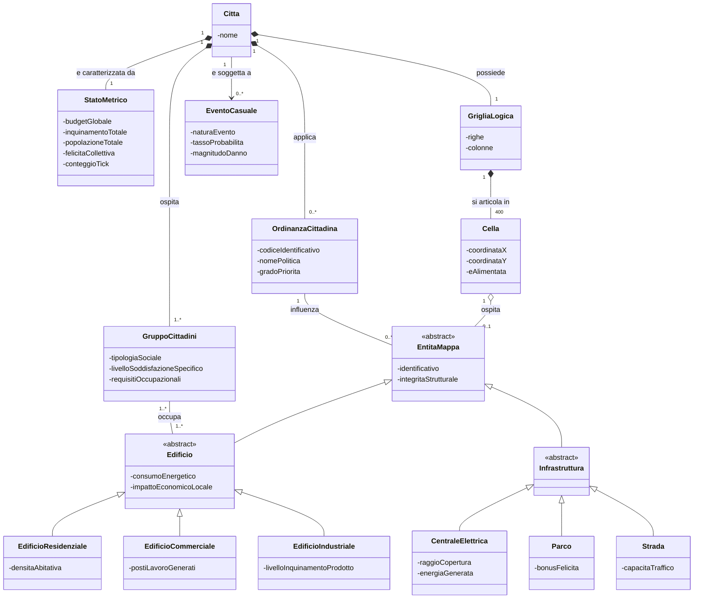

```mermaid
classDiagram
    direction TB

    %% Nucleo Urbano ed Entita
    class EntitaMappa {
        <<abstract>>
        -identificativo
        -integritaStrutturale
    }
    class Edificio {
        <<abstract>>
        -consumoEnergetico
        -impattoEconomicoLocale
    }
    class EdificioResidenziale {
        -densitaAbitativa
    }
    class EdificioCommerciale {
        -postiLavoroGenerati
    }
    class EdificioIndustriale {
        -livelloInquinamentoProdotto
    }
    class Infrastruttura {
        <<abstract>>
    }
    class CentraleElettrica {
        -raggioCopertura
        -energiaGenerata
    }
    class Parco {
        -bonusFelicita
    }
    class Strada {
        -capacitaTraffico
    }

    %% Stato e Dinamiche Globali
    class Citta {
        -nome
    }
    class StatoMetrico {
        -budgetGlobale
        -inquinamentoTotale
        -popolazioneTotale
        -felicitaCollettiva
        -conteggioTick
    }
    class GrigliaLogica {
        -righe
        -colonne
    }
    class Cella {
        -coordinataX
        -coordinataY
        -eAlimentata
    }

    %% Sistemi Regolatori ed Eventi
    class OrdinanzaCittadina {
        -codiceIdentificativo
        -nomePolitica
        -gradoPriorita
    }
    class GruppoCittadini {
        -tipologiaSociale
        -livelloSoddisfazioneSpecifico
        -requisitiOccupazionali
    }
    class EventoCasuale {
        -naturaEvento
        -tassoProbabilita
        -magnitudoDanno
    }

    %% Relazioni e Molteplicita
    Citta "1" *-- "1" StatoMetrico : e caratterizzata da
    Citta "1" *-- "1" GrigliaLogica : possiede
    GrigliaLogica "1" *-- "400" Cella : si articola in
    Cella "1" o-- "0..1" EntitaMappa : ospita

    EntitaMappa <|-- Edificio
    EntitaMappa <|-- Infrastruttura

    Edificio <|-- EdificioResidenziale
    Edificio <|-- EdificioCommerciale
    Edificio <|-- EdificioIndustriale

    Infrastruttura <|-- CentraleElettrica
    Infrastruttura <|-- Parco
    Infrastruttura <|-- Strada

    Citta "1" *-- "0..*" OrdinanzaCittadina : applica
    Citta "1" *-- "1..*" GruppoCittadini : ospita
    Citta "1" --> "0..*" EventoCasuale : e soggetta a

    GruppoCittadini "1..*" -- "1..*" Edificio : occupa
    OrdinanzaCittadina "1" -- "0..*" EntitaMappa : influenza
```
