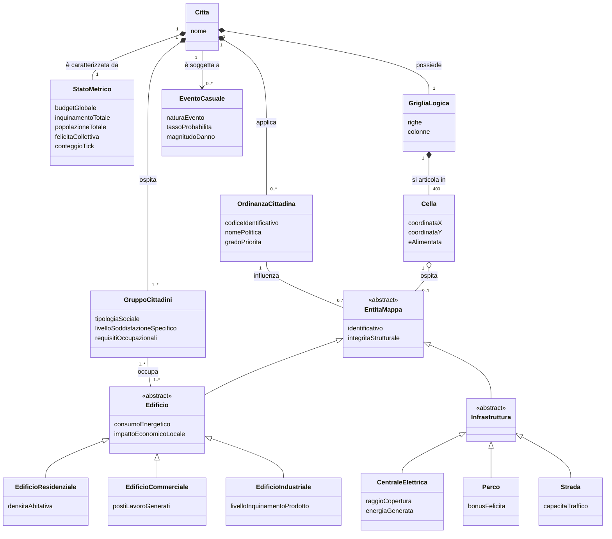
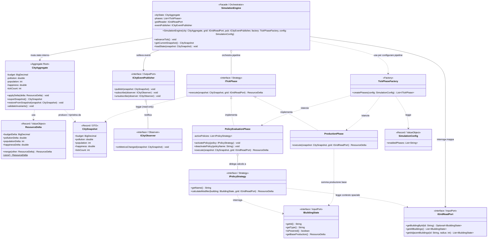
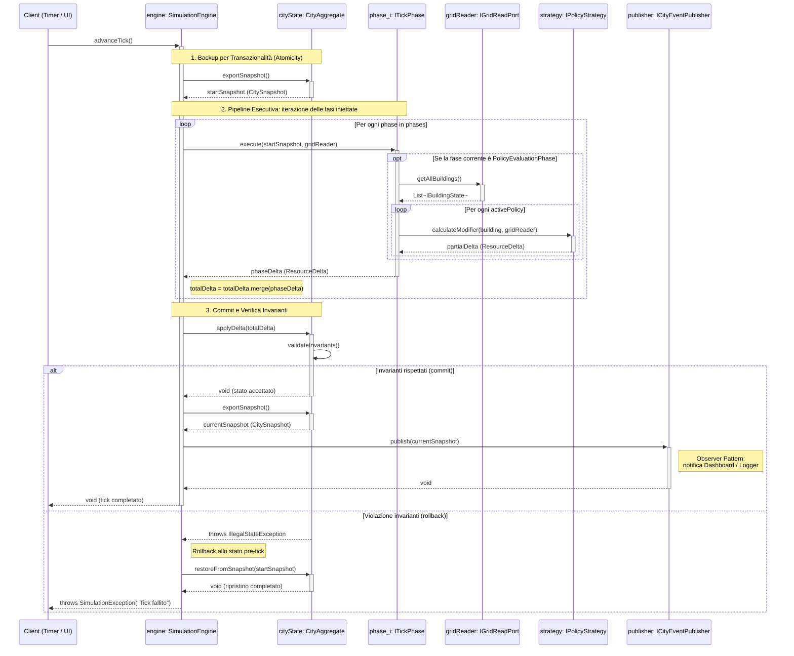

# Citylogic — Core Logic Design (v2, pronto per lo sviluppo)

## Domain Model

**Tracciabilità domain model → design model** (utile per la discussione): `Citta` + `StatoMetrico` → `CityAggregate`; lo stato esportabile di `StatoMetrico` → `CitySnapshot`; `OrdinanzaCittadina` → `IPolicyStrategy`; le entità della griglia (`GrigliaLogica`, `Cella`, gerarchia `EntitaMappa`) restano nel dominio ma nel design del Core compaiono solo dietro i port `IGridReadPort`/`IBuildingState`, perché la loro implementazione è responsabilità del modulo mappa. `GruppoCittadini` ed `EventoCasuale` sono funzionalità opzionali della consegna: nel domain model documentano la visione completa, nel design class diagram entreranno solo se le implementate (un `EventoCasuale` diventerebbe naturalmente una `ITickPhase` aggiuntiva o un evento pubblicato via Observer).

## Design Class Diagram

## Internal Sequence Diagram — advanceTick()

## Note di design (da riusare nel design doc)

**Pattern impiegati**
- **Strategy** (requisito d'esame): `IPolicyStrategy` per le ordinanze (parte di Ludo) e `ITickPhase` per le fasi della pipeline — cambiare politica significa scambiare un oggetto strategia, zero `if/else`.
- **Factory** (requisito d'esame): `TickPhaseFactory` costruisce la pipeline; il `SimulationEngine` non conosce le classi concrete delle fasi.
- **Observer** (requisito d'esame): `ICityEventPublisher`/`ICityObserver` disaccoppiano il Core dalla Dashboard (parte di Cesco) — la UI è strettamente separata dalla logica come da specifica.
- **Facade**: `SimulationEngine` espone al resto del sistema solo `advanceTick()`, `getCurrentSnapshot()`, `loadState()`.

**Scelte chiave e motivazioni (per la discussione orale)**
1. **Le fasi ricevono `CitySnapshot`, non `CityAggregate`**: tutte le fasi leggono lo stesso stato immutabile di inizio tick e restituiscono solo delta. Nessuna fase può mutare lo stato direttamente → la transazionalità è garantita per costruzione, l'ordine delle fasi non crea letture incoerenti, e ogni fase è testabile in isolamento con un semplice record.
2. **`ResourceDelta` come record immutabile** con `merge()`: l'engine accumula i delta e applica un solo `applyDelta()` atomico.
3. **Rollback**: se `validateInvariants()` fallisce (es. budget sotto la soglia minima consentita), lo stato viene ripristinato dallo snapshot di inizio tick e l'errore propagato come `SimulationException`.
4. **Port verso la mappa** (`IGridReadPort`, `IBuildingState`): il Core dipende solo da interfacce, mai dal `MapManager` concreto di Leo → da concordare con lui che le implementi (o un adapter).
5. **`getBaseProduction()` su `IBuildingState`**: senza, `ProductionPhase` non avrebbe dati su cui lavorare; le policy lo usano anche come base per i modificatori.
6. **`getCurrentSnapshot()`/`loadState()`** sull'engine: punto di aggancio per il save/load di Cesco per la parte metriche (la griglia la serializza lui separatamente).

## Ordine di sviluppo consigliato

1. `ResourceDelta`, `CitySnapshot` (record) + unit test su `merge()`
2. `CityAggregate` con `applyDelta`/`validateInvariants`/snapshot + test (incluso edge case budget negativo)
3. Interfacce: `ITickPhase`, `IPolicyStrategy`, `IGridReadPort`, `IBuildingState`, `ICityEventPublisher`, `ICityObserver`
4. `ProductionPhase` + `PolicyEvaluationPhase` testate con stub/mock di `IGridReadPort`
5. `TickPhaseFactory` + `SimulationConfig`
6. `SimulationEngine.advanceTick()` con test di integrazione su commit e rollback
