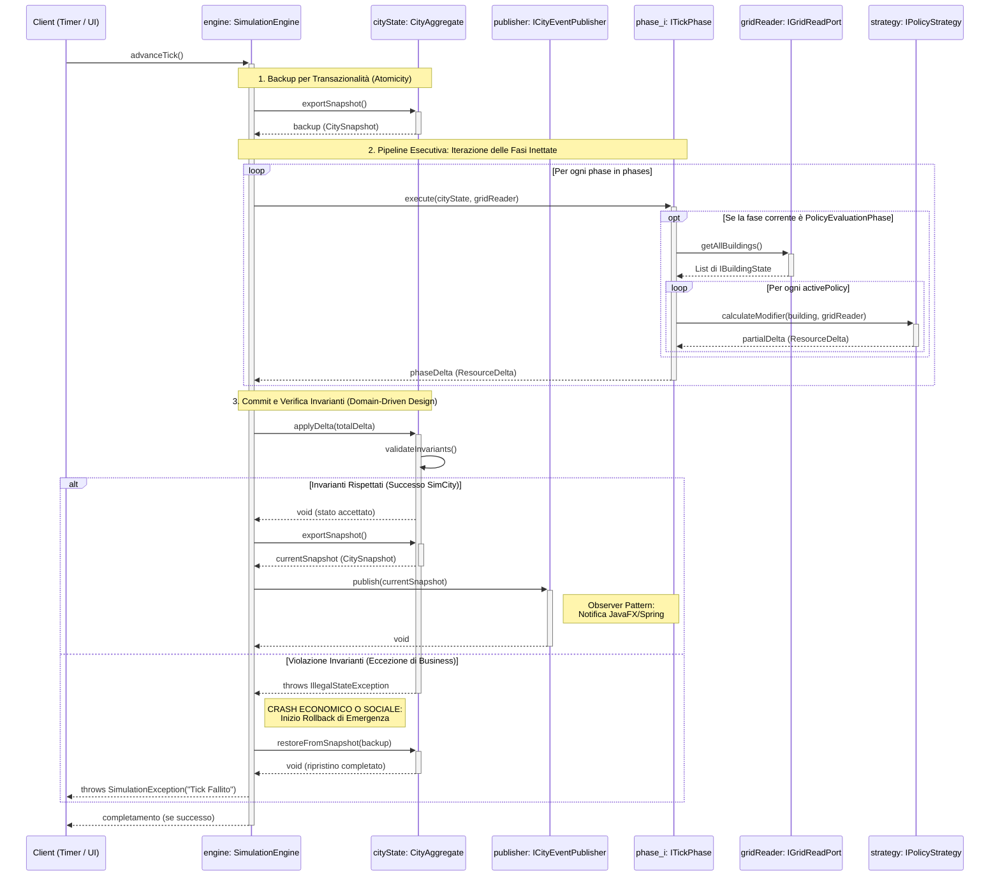

```mermaid

sequenceDiagram
    participant Caller as Client (Timer / UI)
    participant Engine as engine: SimulationEngine
    participant City as cityState: CityAggregate
    participant Pub as publisher: ICityEventPublisher
    participant Phase as phase_i: ITickPhase
    participant Grid as gridReader: IGridReadPort
    participant Strategy as strategy: IPolicyStrategy

    Caller->>+Engine: advanceTick()
    
    %% 1. Creazione Snapshot per potenziale Rollback
    Note over Engine,City: 1. Backup per Transazionalità (Atomicity)
    Engine->>+City: exportSnapshot()
    City-->>-Engine: backup (CitySnapshot)
    
    %% 2. Iterazione Fasi (Factory Pattern in azione invisibile)
    Note over Engine,Phase: 2. Pipeline Esecutiva: Iterazione delle Fasi Inettate
    loop Per ogni phase in phases
        Engine->>+Phase: execute(cityState, gridReader)
        
        opt Se la fase corrente è PolicyEvaluationPhase
            Phase->>+Grid: getAllBuildings()
            Grid-->>-Phase: List di IBuildingState
            
            loop Per ogni activePolicy
                Phase->>+Strategy: calculateModifier(building, gridReader)
                Strategy-->>-Phase: partialDelta (ResourceDelta)
            end
        end
        
        Phase-->>-Engine: phaseDelta (ResourceDelta)
    end

    %% 3. Applicazione Transazionale e Validazione
    Note over Engine,City: 3. Commit e Verifica Invarianti (Domain-Driven Design)
    Engine->>+City: applyDelta(totalDelta)
    City->>City: validateInvariants()
    
    alt Invarianti Rispettati (Successo SimCity)
        City-->>Engine: void (stato accettato)
        
        Engine->>+City: exportSnapshot()
        City-->>-Engine: currentSnapshot (CitySnapshot)
        
        %% Notifica della UI isolata dal Core
        Engine->>+Pub: publish(currentSnapshot)
        Note right of Pub: Observer Pattern:<br/>Notifica JavaFX/Spring
        Pub-->>-Engine: void
        
    else Violazione Invarianti (Eccezione di Business)
        City-->>-Engine: throws IllegalStateException
        
        Note right of Engine: CRASH ECONOMICO O SOCIALE:<br/>Inizio Rollback di Emergenza
        Engine->>+City: restoreFromSnapshot(backup)
        City-->>-Engine: void (ripristino completato)
        
        Engine-->>Caller: throws SimulationException("Tick Fallito")
    end
    
    Engine-->>-Caller: completamento (se successo)

```
