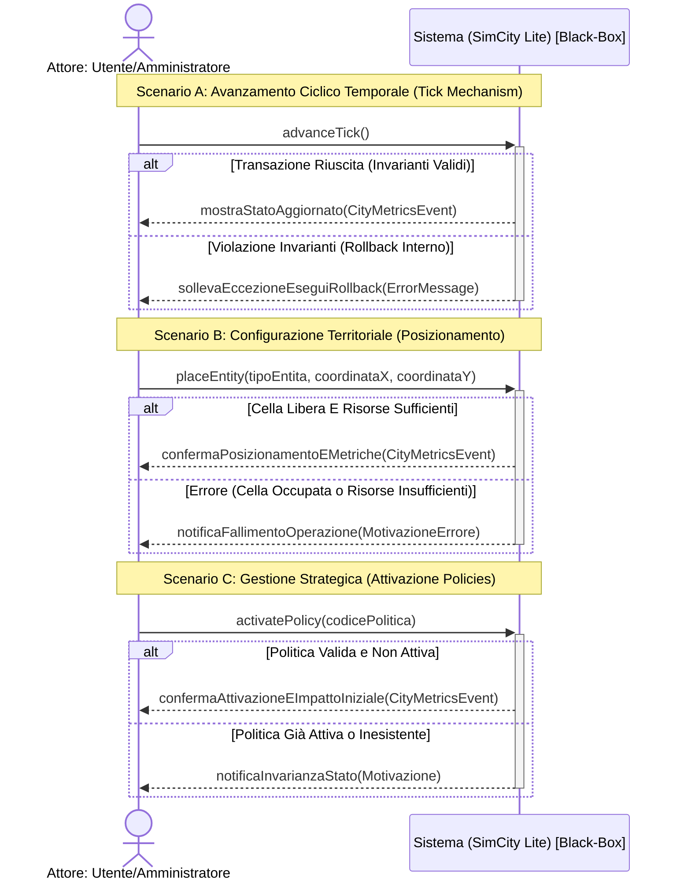

```mermaid

sequenceDiagram
    actor Utente as Attore: Utente/Amministratore
    participant Sistema as Sistema (SimCity Lite) [Black-Box]

    %% Scenario A: Avanzamento del Tempo
    Note over Utente,Sistema: Scenario A: Avanzamento Ciclico Temporale (Tick Mechanism)
    Utente->>+Sistema: advanceTick()
    
    alt Transazione Riuscita (Invarianti Validi)
        Sistema-->>Utente: mostraStatoAggiornato(CityMetricsEvent)
    else Violazione Invarianti (Rollback Interno)
        Sistema-->>-Utente: sollevaEccezioneEseguiRollback(ErrorMessage)
    end

    %% Scenario B: Logica Territoriale
    Note over Utente,Sistema: Scenario B: Configurazione Territoriale (Posizionamento)
    Utente->>+Sistema: placeEntity(tipoEntita, coordinataX, coordinataY)
    
    alt Cella Libera E Risorse Sufficienti
        Sistema-->>Utente: confermaPosizionamentoEMetriche(CityMetricsEvent)
    else Errore (Cella Occupata o Risorse Insufficienti)
        Sistema-->>-Utente: notificaFallimentoOperazione(MotivazioneErrore)
    end

    %% Scenario C: Policies
    Note over Utente,Sistema: Scenario C: Gestione Strategica (Attivazione Policies)
    Utente->>+Sistema: activatePolicy(codicePolitica)
    
    alt Politica Valida e Non Attiva
        Sistema-->>Utente: confermaAttivazioneEImpattoIniziale(CityMetricsEvent)
    else Politica Già Attiva o Inesistente
        Sistema-->>-Utente: notificaInvarianzaStato(Motivazione)
    end
```
